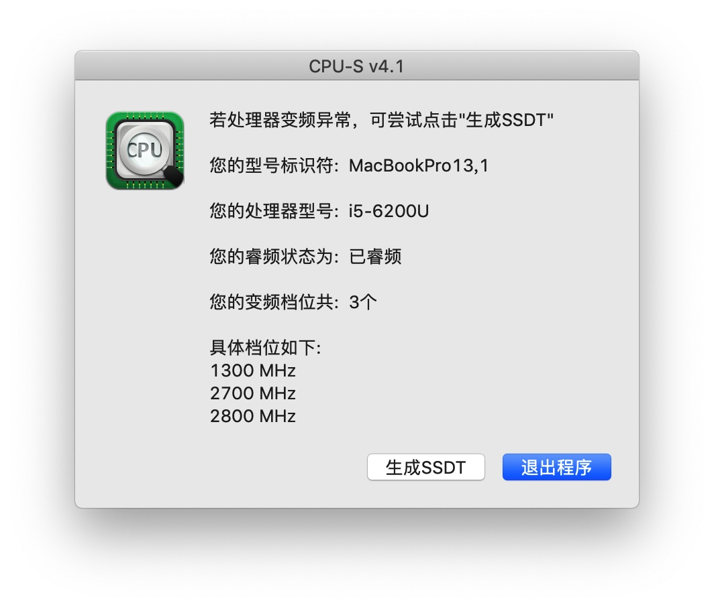
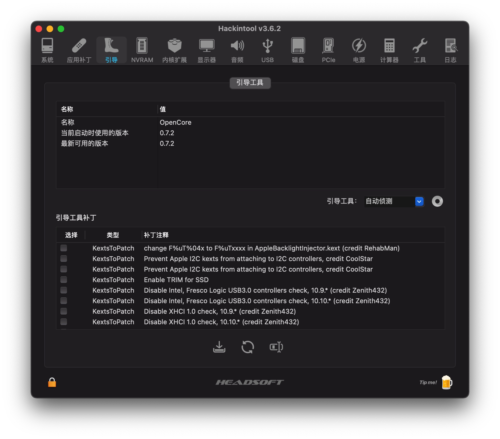
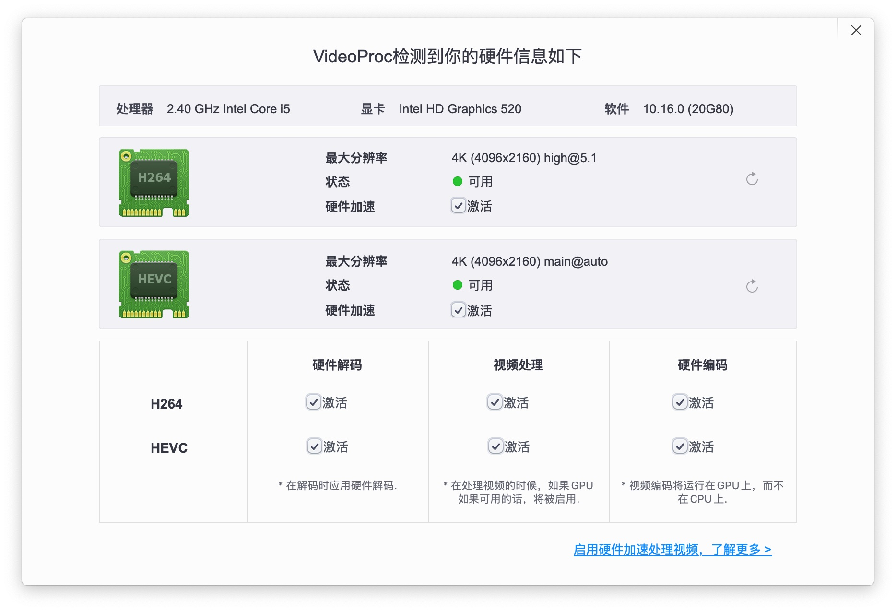
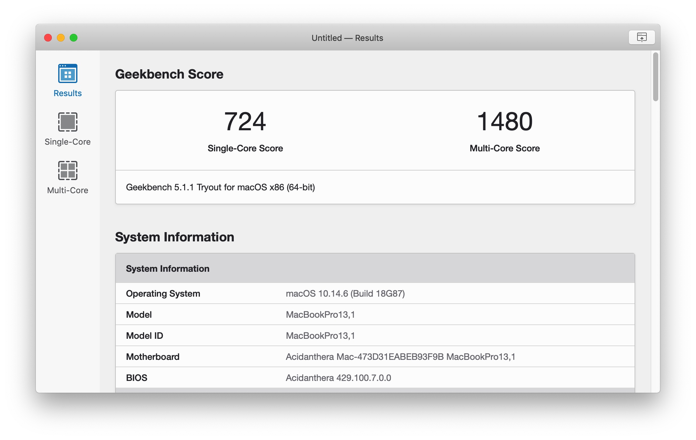

# airbook-6200u-efi

## 介绍
支持最新 bigsur11.5.1，oc版本是最新的0.7.2，所有驱动全是当前最新

## 基本配置

| 名称     | 型号                                         |
| -------- | -------------------------------------------- |
| cpu      | i5 6200u                                     |
| 内存     | 镁光单条16g ddr3l                            |
| 显卡     | hd520（核显）                                |
| 无线网卡 | dw1560（bcm94352z）                          |
| 声卡     | alc269vb                                     |
| 显示器   | 夏普显示器(**LQ133T1JW21**) 分辨率 2560x1440 |
| 硬盘     | 朗科120g固态                                 |

## 系统驱动

| 名称                  | 版本   | 描述                       |
| --------------------- | ------ | -------------------------- |
| macos bigsur          | 11.5.1 | 系统                       |
| AirportBcrmFixup      | 2.1.3  | 修复蓝牙                   |
| AppleALC              | 1.6.3  | 声卡                       |
| BcrmPatchRAM3         | 2.6.0  | 无线                       |
| BrcmBluetoothInjector | 2.6.0  | 蓝牙                       |
| BrcmFirmwareData      | 2.6.0  | 无线 蓝牙依赖              |
| HibernationFixup      | 1.4.2  | 修复睡眠                   |
| Lilu                  | 1.5.5  | 核心                       |
| VoodooPS2Controller   | 2.2.4  | 触摸板和键盘               |
| WhateverGreen         | 1.5.2  | 显卡                       |
| VirtualSMC            | 1.2.6  | 核心                       |
| SMCProcessor          | 1.2.6  | 处理器温度                 |
| SMCSuperIO            | 1.2.6  | 温度检测                   |
| USBPorts              |        | usb定制                    |
| ECEnabler             | 1.0.2  | 电池驱动依赖，不用拆字节了 |
| ACPIBatteryManager    | 1.90.1 | 电池驱动                   |

## 功能完善度

- [x] 扩展分屏显示
- [x] 睡眠唤醒
- [x] usb定制，usb3达到5g传输速度
- [x] 电池电量显示（显示充电图标，显示电量百分比）
- [x] 内置喇叭外放内放出声，插拔耳机正常
- [x] Wifi 无线连接，蓝牙，airdrop，投屏显示正常
- [x] cpu，硬盘温度监控，功耗监控
- [x] cpu睿频加速
- [x] 亮度调节（f1，f2  自行设置快捷键）
- [x] 开盖唤醒
- [x] 内屏hidpi（自行使用hidpi.sh）
- [x] 摄像头正常使用
- [x] 盒盖睡眠
- [x] 随航
- [ ] 内置sd卡识别

## 变更记录

- **3.0.1**
  - 支持bigsur11.5.1，oc升级到0.7.2，驱动所有硬件
  - 修复睡眠就唤醒的问题
  - 解决wifi驱动冲突导致启动缓慢的问题

## 效果截图

### 系统

### oc版本

### 电池状态：

- 弱电：低于10%电池变红
- 充电：插电出闪电
- 拔掉电源：闪电消失
- 满格：电池进度满格加闪电标识

### 显卡硬件解码

### Geekbench5跑分

### USB定制

