# airbook-6200u-efi

  

## 介绍
airbook支持ventura ，所有kext驱动更新最新

## 已知问题

- 开hidpi闪屏  或者分辨率开到2.5k闪屏

## 基本配置

| 名称     | 型号                                         |
| -------- | -------------------------------------------- |
| cpu      | i5 6200u                                     |
| 内存     | 镁光单条16g ddr3l                            |
| 显卡     | hd520（核显）                                |
| 无线网卡 | dw1560（bcm94352z）                          |
| 声卡     | alc269vb                                     |
| 显示器   | 夏普显示器(**LQ133T1JW21**) 分辨率 2560x1440 |
| 硬盘     | 朗科120g固态                                 |

## 系统驱动

| 名称                         | 版本                                                         | 描述                       |
| ---------------------------- | ------------------------------------------------------------ | -------------------------- |
| AirportBcrmFixup             |  | wifi                       |
| AppleALC                     |  | 声卡                       |
| BcrmPatchRAM3                |  | 蓝牙                       |
| BlueToolFixup                |  | 蓝牙                       |
| BrcmFirmwareData             |  | 蓝牙                       |
| HibernationFixup             |  | 修复睡眠                   |
| Lilu                         |  | 核心                       |
| VoodooPS2Controller          |  | 触摸板和键盘               |
| WhateverGreen                |  | 显卡                       |
| VirtualSMC                   |  | 核心                       |
| SMCProcessor                 |  | 处理器温度                 |
| SMCBatteryManager            |  | 电池驱动                   |
| SMCSuperIO                   |  | 温度检测                   |
| ECEnabler                    |  | 电池驱动依赖，不用拆字节了 |
| USBPorts                     |                                                              | usb定制                    |
| RealtekCardReaderFriend.kext |  |                            |
| RealtekCardReader.kext       |  |                            |

## 功能完善度

- [x] 扩展分屏显示
- [x] 睡眠唤醒
- [x] usb定制，usb3达到5g传输速度
- [x] 电池电量显示（显示充电图标，显示电量百分比）
- [x] 内置喇叭外放内放出声，插拔耳机正常
- [x] Wifi 无线连接，蓝牙
- [x] airdrop，接力
- [x] cpu，硬盘温度监控，功耗监控
- [x] cpu睿频加速
- [x] 亮度调节（f1，f2  自行设置快捷键）
- [x] 开盖唤醒
- [x] 内屏hidpi（自行使用hidpi.sh）
- [x] 摄像头正常使用
- [x] 盒盖睡眠
- [ ] 随航（有线可以，无线不行）
- [x] 内置sd卡识别

## 变更记录

- 5.6
  - 更新085
  
- 5.5
  - 更新驱动和oc084

- 5.4
  - 解决外接显示紫色屏幕的问题

- 5.3
  - 更新hackintosh主题
  - 增加启动画面截屏
  - 修改睡眠唤醒wifi断开问题，更新驱动

- 5.2
  - 基本完美，完善驱动和机型

## 效果截图

### 系统

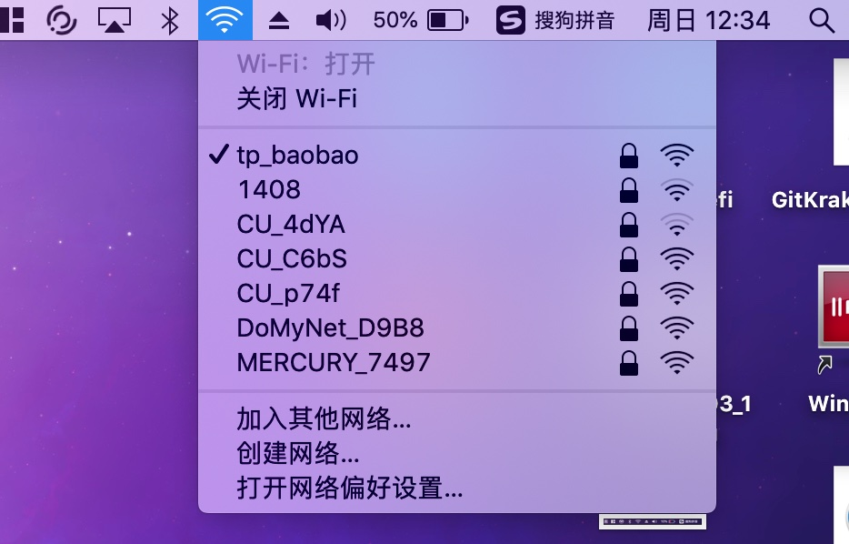

### 美化启动界面

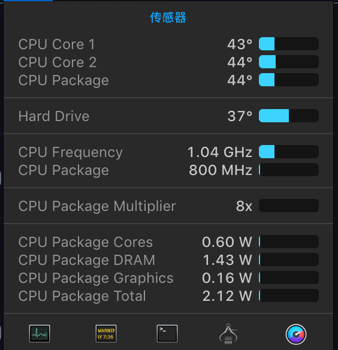

### oc版本

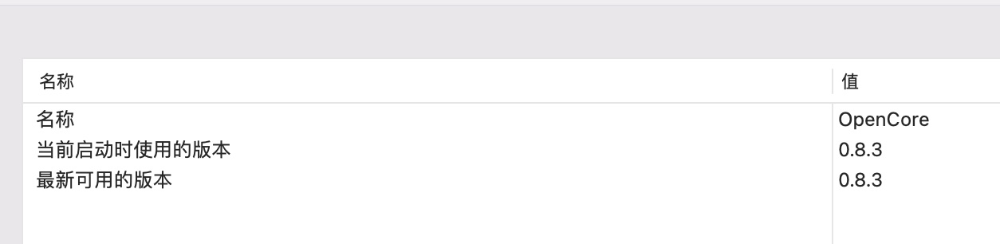

### Geekbench5跑分

### 视频解码

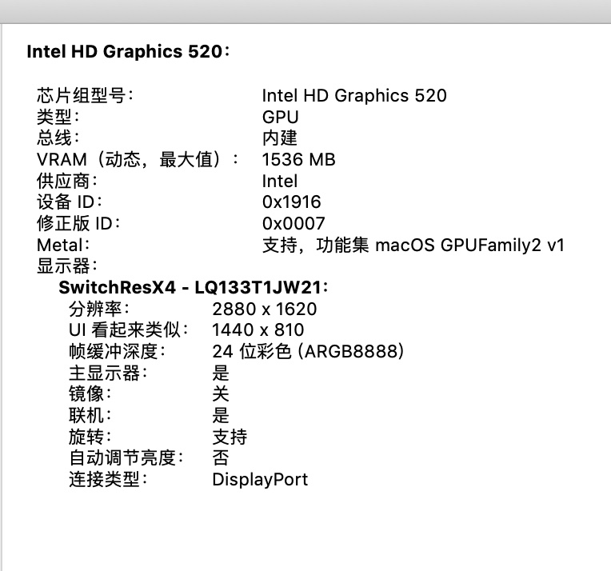

### sd 读卡器测速

## bios相关配置参考：

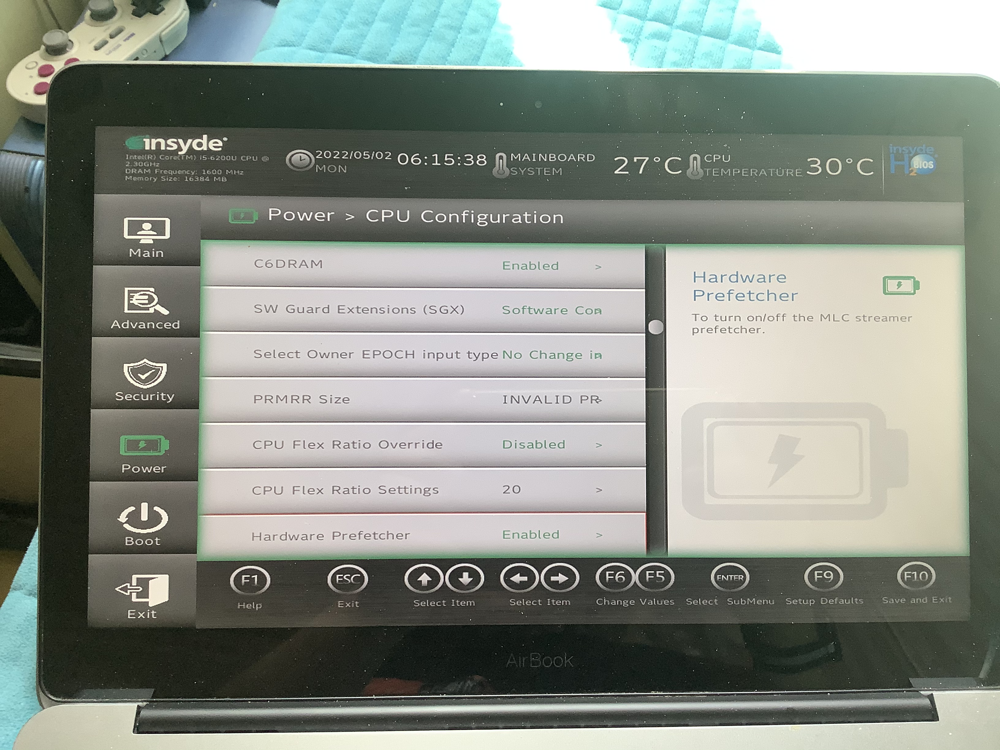

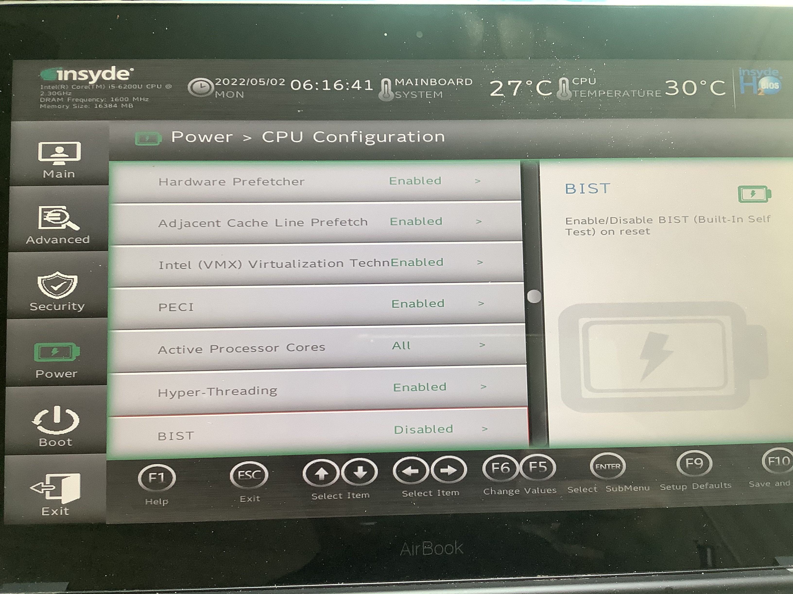

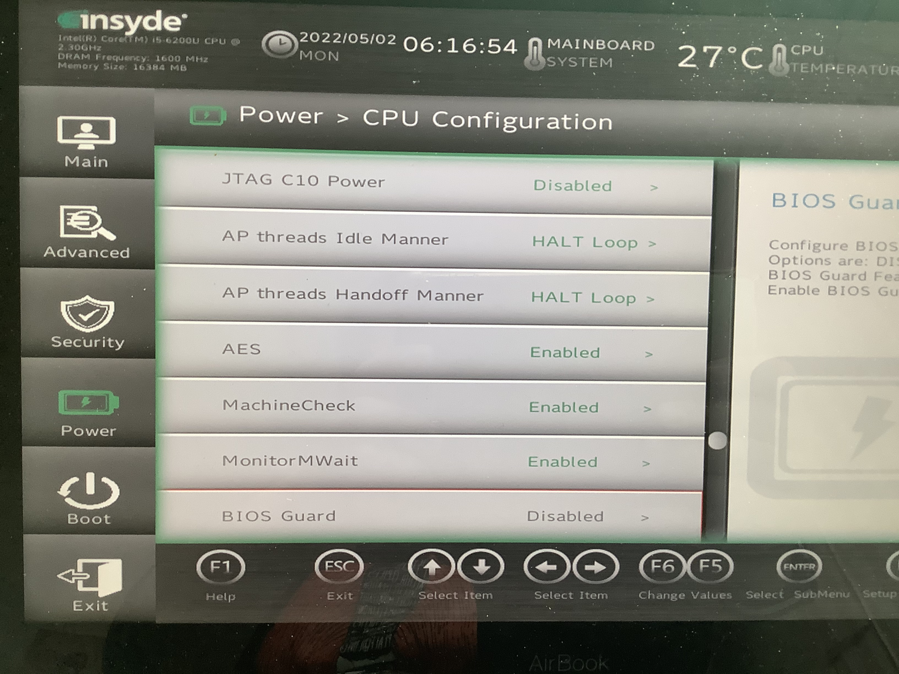

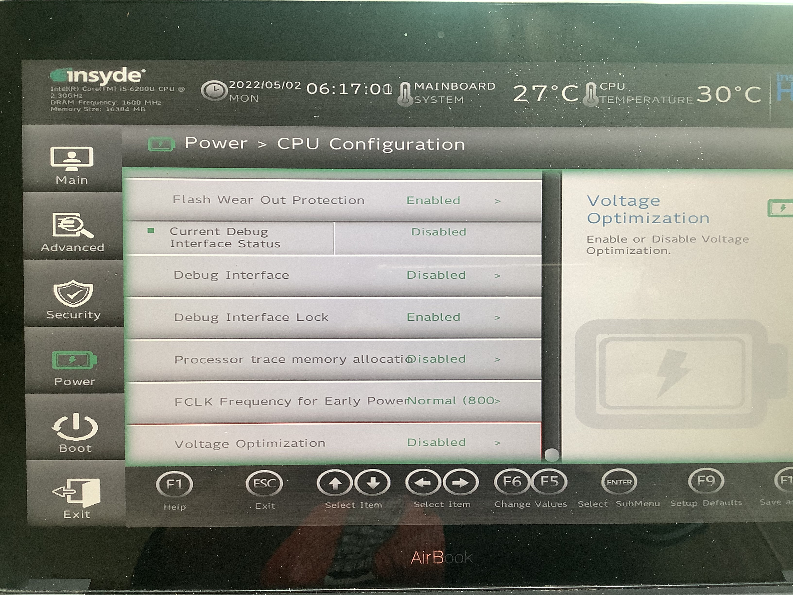

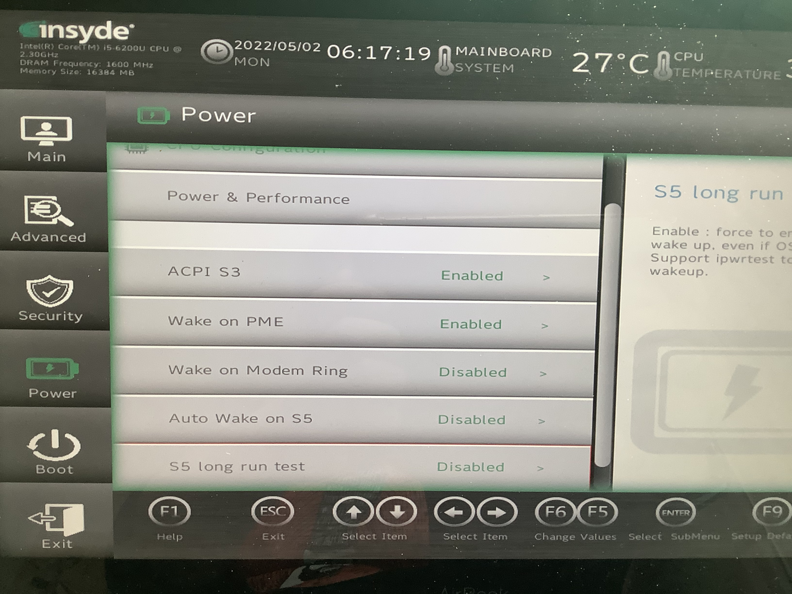

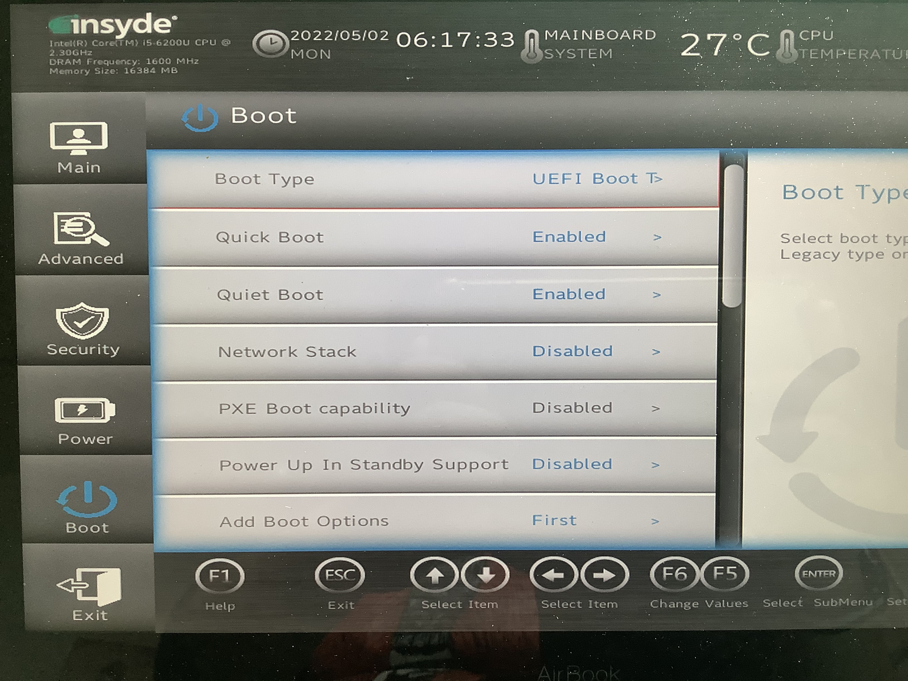

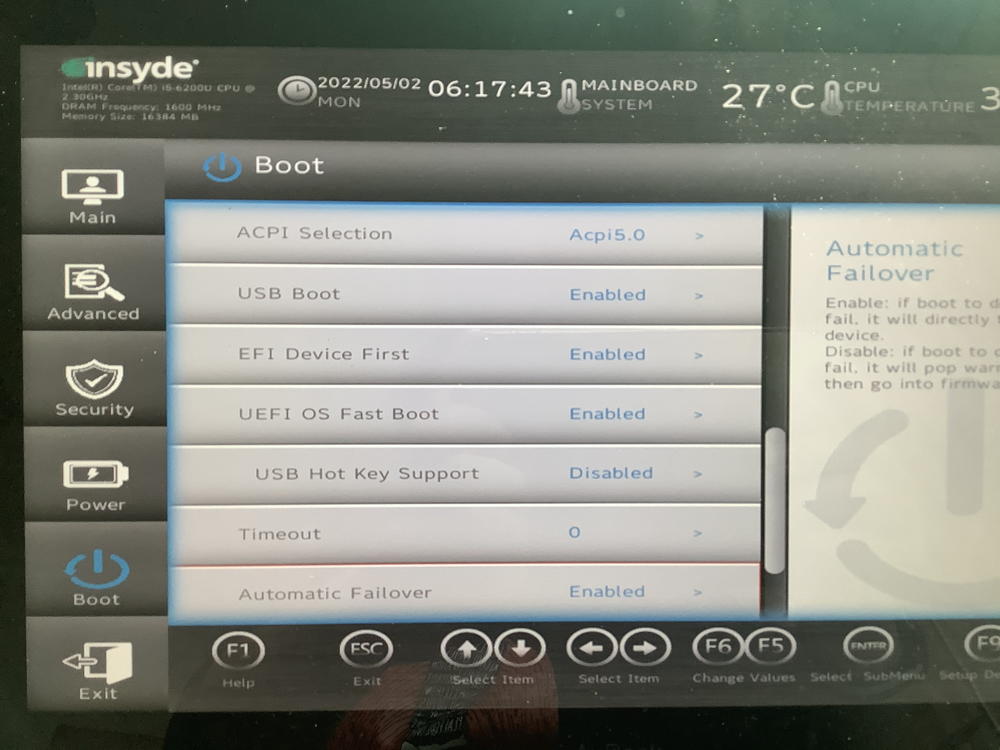
