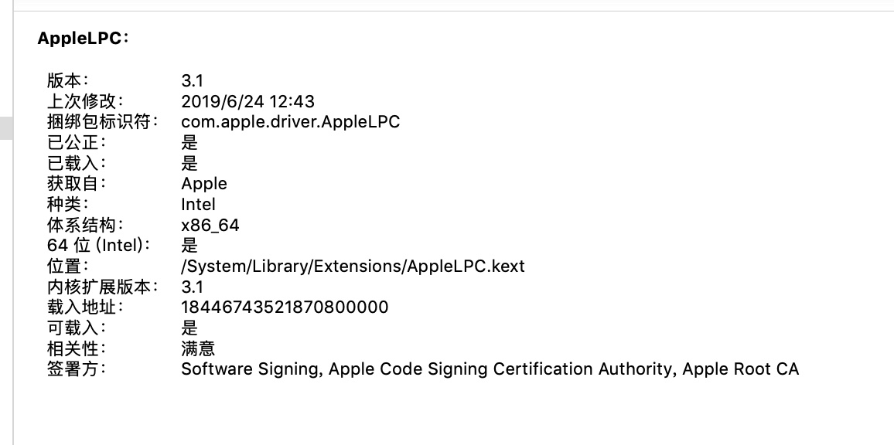
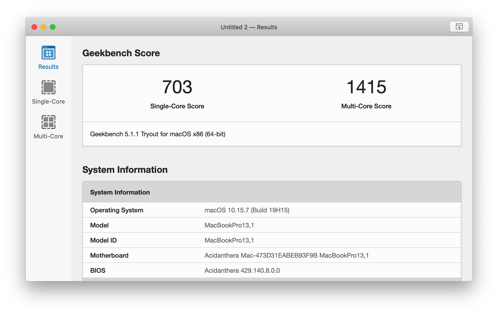
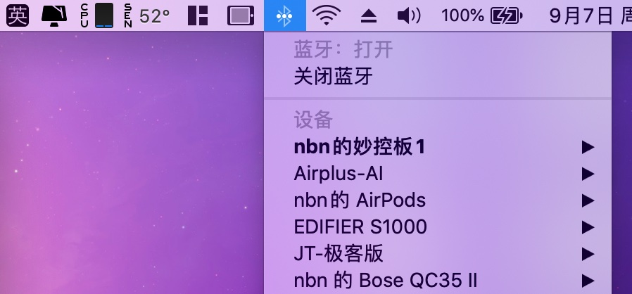

# airbook-6200u-efi

  

## 介绍
airbook支持monterey ，所有kext驱动更新最新

## 已知问题

- 电池电量不显示闪电(需要关机一段时间之后在启动有时候就会好，暂时不太清楚原因)12.1已经解决这个问题

- 无线随航不太好使，有线随航可以

- 如果充电状态闪电可以显示，盒盖睡眠就正常

- 使用电池启动，在不插电的情况下，耗电到10%以下如果再插电不会显示闪电

- 【已修复】不插电启动或者不插电睡眠唤醒，在电量10%以下出现提示的情况下，插电会直接黑屏  

  

## 基本配置

| 名称     | 型号                                         |
| -------- | -------------------------------------------- |
| cpu      | i5 6200u                                     |
| 内存     | 镁光单条16g ddr3l                            |
| 显卡     | hd520（核显）                                |
| 无线网卡 | dw1560（bcm94352z）                          |
| 声卡     | alc269vb                                     |
| 显示器   | 夏普显示器(**LQ133T1JW21**) 分辨率 2560x1440 |
| 硬盘     | 朗科120g固态                                 |

## 系统驱动

| 名称                         | 版本                                                         | 描述                       |
| ---------------------------- | ------------------------------------------------------------ | -------------------------- |
| AirportBcrmFixup             |  | wifi                       |
| AppleALC                     |  | 声卡                       |
| BcrmPatchRAM3                |  | 蓝牙                       |
| BrcmBluetoothInjector        |  | 蓝牙                       |
| BrcmFirmwareData             |  | 蓝牙                       |
| HibernationFixup             |  | 修复睡眠                   |
| Lilu                         |  | 核心                       |
| VoodooPS2Controller          |  | 触摸板和键盘               |
| WhateverGreen                |  | 显卡                       |
| VirtualSMC                   |  | 核心                       |
| SMCProcessor                 |  | 处理器温度                 |
| SMCBatteryManager            |  | 电池驱动                   |
| SMCSuperIO                   |  | 温度检测                   |
| ECEnabler                    |  | 电池驱动依赖，不用拆字节了 |
| USBPorts                     |                                                              | usb定制                    |
| RealtekCardReaderFriend.kext |  |                            |
| RealtekCardReader.kext       |  |                            |

## 功能完善度

- [x] 扩展分屏显示
- [x] 睡眠唤醒
- [x] usb定制，usb3达到5g传输速度
- [x] 电池电量显示（显示充电图标，显示电量百分比）
- [x] 内置喇叭外放内放出声，插拔耳机正常
- [x] Wifi 无线连接，蓝牙
- [x] airdrop，接力
- [x] cpu，硬盘温度监控，功耗监控
- [x] cpu睿频加速
- [x] 亮度调节（f1，f2  自行设置快捷键）
- [x] 开盖唤醒
- [x] 内屏hidpi（自行使用hidpi.sh）
- [x] 摄像头正常使用
- [x] 盒盖睡眠
- [ ] 随航（有线可以，无线不行）
- [x] 内置sd卡识别

## 变更记录

- 4.1.9
  - 更新0.8.0
- 4.1.8
  - 更新oc0.7.9
- 4.1.7
  - fix: 修复低电量开机，插电直接黑屏的问题
- 4.1.6
  - 更新oc0.7.8和驱动
- 4.1.5
  - 更新oc 0.7.7和驱动
- 4.1.4
  - 修复电池启动会出现黑屏的情况，调高分屏framebuffer 缓冲帧内存
- 4.1.3
  - 更新kext到最新
- 4.1.2
  - 升级oc0.7.6正式版 更新驱动，支持最新系统到12.1beta
- 4.1.1
  - 更新oc0.7.5正式版，所有驱动更新最新正式版
- 4.1.0
  - 成功驱动sd卡
- 4.0.1
  - 修复蓝牙不可用的问题
- 4.0.0
  - 基本完美支持macos12  随航不知为何不能用，其余都正常

## 效果截图

### 系统

### oc版本

### 电池状态：

### Geekbench5跑分

### USB定制

### 读卡器

